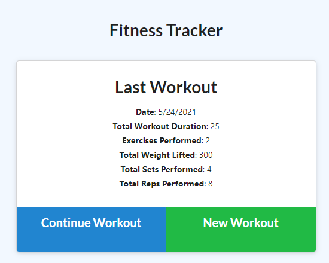
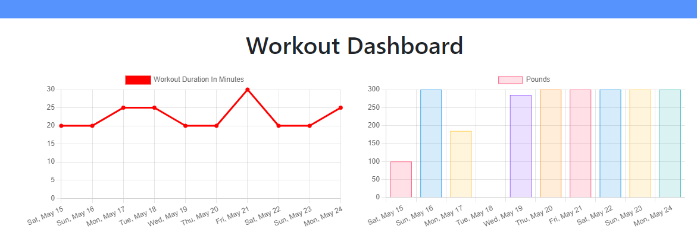

# Workout Tracker!

## Description

This application utilizes a Mongo database through a mongoose schema in order to create an easy-to-use tool that tracks your workouts. 
After logging a few items of information about your workout, the data is stored and graphed for the user in two different graphs on the
dashboard

### Technology Used

Node.js, Javascript, Mongoose, Express, MongoDB

### Visuals

### Links
Github Repository: https://github.com/will98nicholson/workout
Heroku Deployment: https://polar-badlands-13807.herokuapp.com/